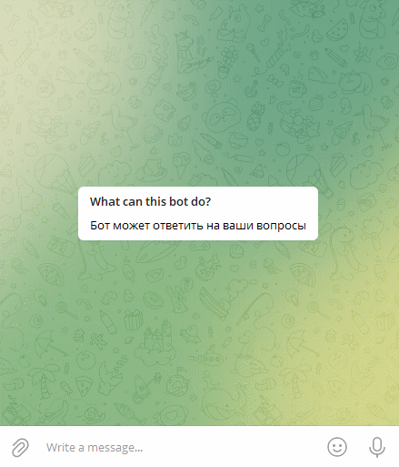
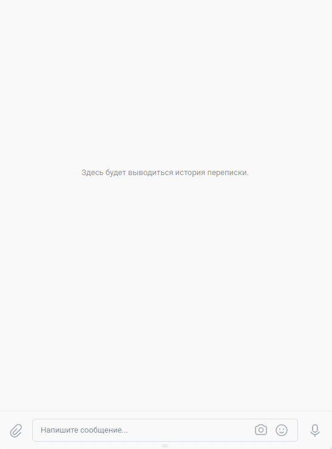

# Пример работы Telegram и VK ботов с [DialogFlow API](https://dialogflow.cloud.google.com/)

Репозиторий содержит скрипты для запуска Telegram и VK ботов, а также скрипт для обучения DialogFlow агента.

Работа Telegram-бота:



Работа VK-бота:



Также можно протестировать работу ботов самому: 
  - [Telegram-бот](https://t.me/verbs_game_helper_bot)
  - [группа VK](https://vk.com/public210058270)

## Запуск

- Скачайте код
- Настройте окружение. Для этого выполните следующие действия:
  - установите Python3.x;
  - создайте виртуальное окружение [virtualenv/venv](https://docs.python.org/3/library/venv.html) для изоляции проекта и активируйте его.
  - установите необходимые зависимости:

    ```
    pip install -r requirements.txt
    ```
  - Создайте Telegram-бота и получите токен. Воспользуйтесь услугами [BotFather](https://telegram.me/BotFather), для этого необходимо ввести `/start` и следовать инструкции.
  - Чтобы получить свой `chat_id`, напишите в Telegram специальному боту: `@userinfobot`
  - Создайте группу [VK](https://vk.com/) и получите токен в настройках cообщений пункт `Работа с API`.
  - Создайте [проект DialogFlow](https://dialogflow.cloud.google.com/#/getStarted)
  - Создайте [агента DialogFlow](https://cloud.google.com/dialogflow/es/docs/quick/build-agent)
  - В директории со скриптами создайте файл `.env`, в котором будут храниться чувствительные данные:
    ```
    TG_BOT_TOKEN='токен telegram-бота'
    GOOGLE_APPLICATION_CREDENTIALS='путь к файлу с конфиденциальными данными Google Cloud проекта'
    GOOGLE_CLOUD_PROJECT_ID='ID Google Cloud проекта'
    TRAINING_PHRASES_FILEPATH='путь к файлу с наборами фраз для обучения DialogFlow агента'
    LANGUAGE_CODE=ru-RU
    VK_GROUP_TOKEN='токен VK-бота'
    ADMIN_CHAT_ID='ваш чат-id'
    ```
  - Обучите агента `DialogFlow` командой:
    ```
    python create_intents.py
    ```
  - запустите VK-бота командой:
    ```
    python vk_bot.py
    ```
  - запустите  Telegram-бота командой:
    ```
    python tg_bot.py
    ```

## Деплой ботов на [Heroku](https://id.heroku.com/login)

- Разместите код в своем репозитории на GitHub.
- Зарегистрируйтесь на Heroku и создайте приложение во вкладке `Deploy`.
- Сохраните чувствительные данные во вкладке `Settings` в `Config Vars`.
- Добавьте [google-application-credentials-buildpack](https://github.com/gerynugrh/heroku-google-application-credentials-buildpack) и стандартный python-buildpack.
- Выберите ветку `main` нажмите `Deploy Branch` во вкладке `Deploy`.
- Активируйте процессы на вкладке `Resources`.
Для просмотра в консоли возможных ошибок при деплое используйте [Heroku CLI](https://devcenter.heroku.com/articles/heroku-cli#download-and-install).

## Цели проекта
Код написан в учебных целях — это урок в курсе по Python и веб-разработке на сайте [Devman](https://dvmn.org).